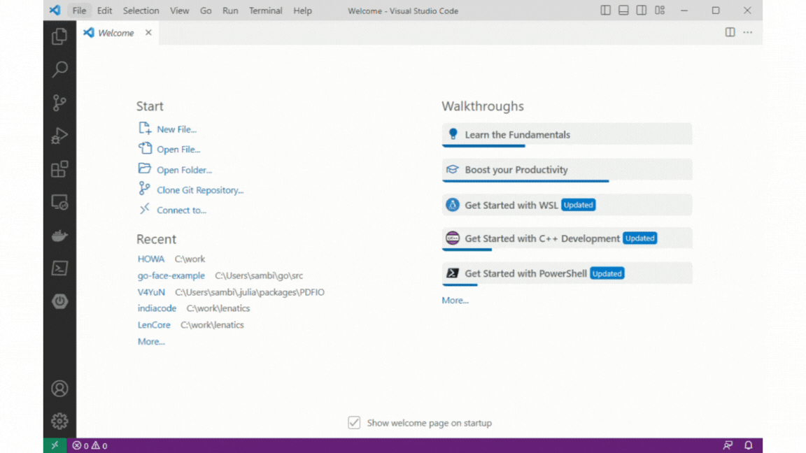

*This repository utilizes symlinks on all platforms. Please use the following command on GitHub before cloning this repository.*

`git config --global core.symlinks true`

*Windows 10 and later support symlinks. Follow [this article](https://blogs.windows.com/windowsdeveloper/2016/12/02/symlinks-windows-10/) to understand more about them and activate them. On all Unix-like environments like Linux and MacOS they are supported by default.*

## Ultimate Web Authentication Handbook
This is the repository for [Ultimate Web Authentication Handbook
](https://orangeava.com/products/ultimate-web-authentication-handbook), published by Orange AVA™

## About the Book
In today's digital landscape, web apps evolve rapidly, demanding enhanced security. This Ultimate Web Authentication Handbook offers a comprehensive journey into this realm. Beginning with web authentication basics, it builds a strong foundation. You'll explore cryptography fundamentals, essential for secure authentication. The book delves into the connection between authentication and network security, mastering federated authentication via OAuth and OIDC protocols. 

You'll also harness multi factor authentication's power and stay updated on advanced trends. The book expands on deepening your understanding of Java Web Token (JWT), FIDO 2, WebAuthn, and biometric authentication to fortify web apps against multifaceted threats. Moreover, you'll learn to use Identity and Access Management (IAM) solutions for constructing highly secure systems. Whether you're a developer, security enthusiast, or simply curious about web security, this book unlocks the secrets of secure online interactions.

## What you will learn

● Comprehend Web Application Architectures and Enhance Security Measures. 

● Implement Robust Web Security with Public Key Cryptography. 

● Harness SAML, OAuth, and OIDC for Advanced User Authentication and Authorization. 

● Strengthen Web App Security with Multi Factor Authentication. Transition to Passwordless Authentication with FIDO and Biometric Security. 

● Stay Ahead with Insights into Digital Identity, Biometric Authentication, Post-Quantum Cryptography, and Zero Trust Architecture Trends.

## More products
1. [Ultimate Blockchain Security Handbook](https://orangeava.com/products/ultimate-blockchain-security-handbook?pr_prod_strat=use_description&pr_rec_id=2c5398f59&pr_rec_pid=8070704234714&pr_ref_pid=8091329954010&pr_seq=uniform)

2. [Ultimate Neural Network Programming with Python](https://orangeava.com/products/ultimate-neural-network-programming-with-python?_pos=1&_sid=a96e61c00&_ss=r)

3. [Practical Java Programming with ChatGPT](https://orangeava.com/products/practical-java-programming-with-chatgpt?_pos=2&_sid=a96e61c00&_ss=r)

## Visit Website 
[ORANGE AVA™](https://orangeava.com)

## VS Code 

Open the folder in Visual Studio Code. All the sample codes for each chapter are
in their respective folders. 

### Launch Scripts

Launch scripts (`.vscode/launch.json`)are available for all the code samples 
from Chapter-1 to 6. 

In Chapter-5, GitHub examples populate the environment variables
 `GH_CLIENT_ID` and `GH_CLIENT_SECRET`.
Similarly, for Google OIDC demo, populate the `GOOGLE_CLIENT_ID` and 
`GOOGLE_CLIENT_SECRET`. You will need to provide them in the `launch.json`, if 
you are using the `VS Code Launchers`.

Due to additional configurations, launch scripts are unavailable for 
face match demo in Chapter-7.

## Security Implications

We have shared the __root certificates and keys__ as part of this repository for 
ease of use. While running the demos, you may __trust the roots__ in the browser 
for a seamless HTTPS experience. With certificates with their private keys 
published, any rogue player can generate a chain of server certificates and dupe
you into accessing their sites as trusted sites. Here are some recommendations:
- Follow the steps in Appendix C and create your own certificate chain for
Server Root (`sroot`), Server Intermediate (`sint`), and Server certificates 
(`mysrv.local, idp.local, hr.mysrv.local, finance.mysrv.local, etc.`), and
- Client Root (`croot`) , Client Intermediate (`cint`), and Client certificates 
  (`alice`).
- Some browsers, like Chrome, can import local root certificates to a specific 
  profile. You can use that profile while running the sample code to minimize 
  the exposure to the internet. 

Use those private hierarchies for your experiments. A rogue actor cannot access 
your private certificate hierarchy. 

If you decide to use the certificate hierarchy published in this repository, 
__positively delete__ the imported roots and intermediates as soon as your 
experiments are over for the least exposure to attacks. 

__We are not responsibile for any breaches due to using the published certificate hierarchies.__ 
