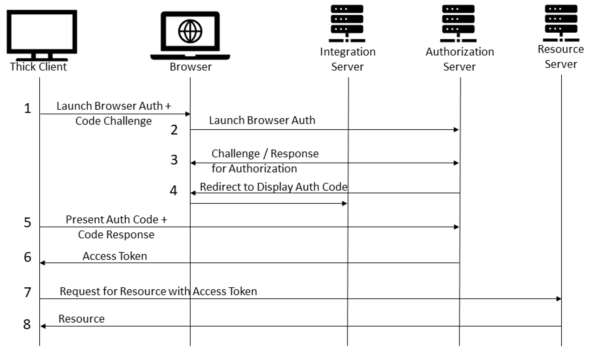
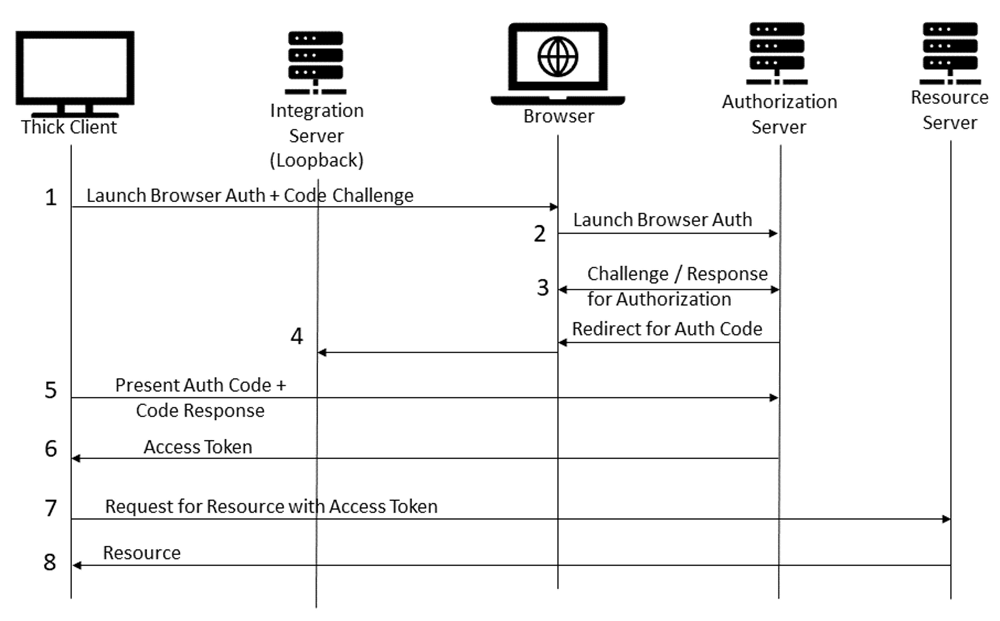
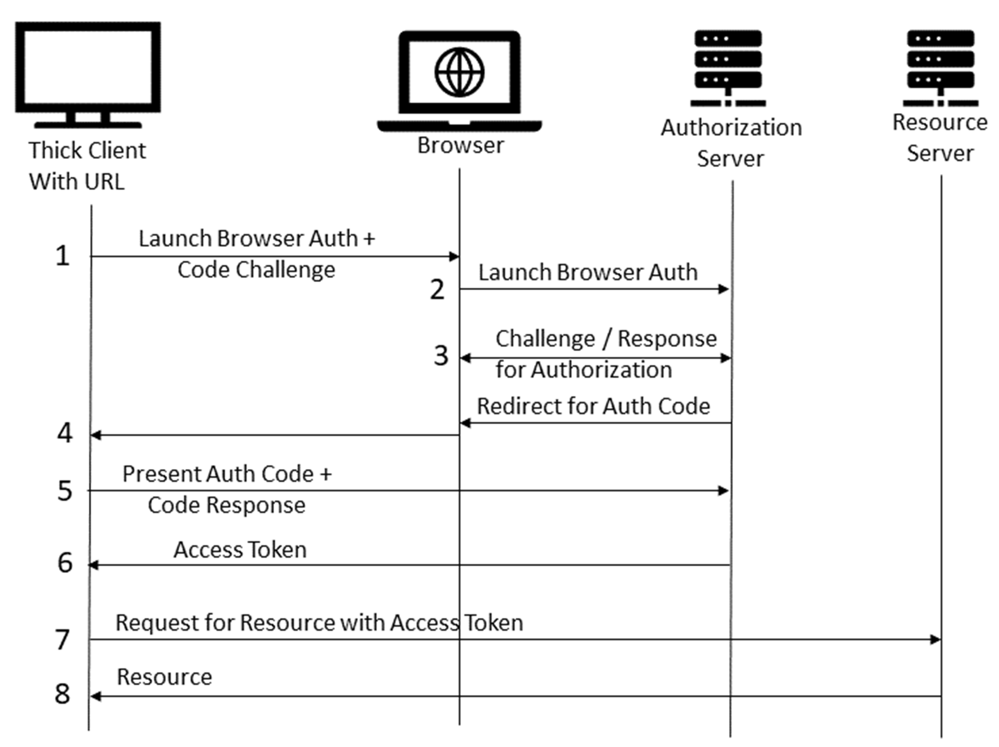

# A Note on PKCE

OAuth 2.0 has existed for over a decade, serving the federated web
authentication and authorization needs. The challenge-response workflow of a
browser and authorization server makes it easier to include configurable
workflows for authorization and federate the authorization needs to a dedicated
server without collecting any credential information from the user. It will be
hard to achieve with non-browser clients as they will render the user interface
and can gather credentials in the client. Since the thick clients are the
service provider (SP) components, it will be ideal if the user presents the
credentials to the Identity Provider (IDP) without using the client app. PKCE is
one of the ways to achieve this. 

We initiate a PKCE workflow from a native client and delegate the user
authentication, authorization, and consent management to a browser. The native
client-to-browser data transfer is unsecured and can be tracked by a malicious
application installed on the system. This is the backbone assumption of
developing the PKCE protocol. [RFC
7636](https://datatracker.ietf.org/doc/html/rfc7636) identifies this limitation
and depicts it in Figure 1 below. 

```
    +~~~~~~~~~~~~~~~~~~~~~~~~~~~~~~~~+
    | End Device (e.g., Smartphone)  |
    |                                |
    | +-------------+   +----------+ | (6) Access Token  +----------+
    | |Legitimate   |   | Malicious|<--------------------|          |
    | |OAuth 2.0 App|   | App      |-------------------->|          |
    | +-------------+   +----------+ | (5) Authorization |          |
    |        |    ^          ^       |        Grant      |          |
    |        |     \         |       |                   |          |
    |        |      \   (4)  |       |                   |          |
    |    (1) |       \  Authz|       |                   |          |
    |   Authz|        \ Code |       |                   |  Authz   |
    | Request|         \     |       |                   |  Server  |
    |        |          \    |       |                   |          |
    |        |           \   |       |                   |          |
    |        v            \  |       |                   |          |
    | +----------------------------+ |                   |          |
    | |                            | | (3) Authz Code    |          |
    | |     Operating System/      |<--------------------|          |
    | |         Browser            |-------------------->|          |
    | |                            | | (2) Authz Request |          |
    | +----------------------------+ |                   +----------+
    +~~~~~~~~~~~~~~~~~~~~~~~~~~~~~~~~+

             RFC 7636 Figure 1: Authorization Code Interception Attack
```
However, the same RFC presents Figure 2 (shown below) where the communication of
the client and authorization server is shown. The client sends certain requests
to the authorization server and receives a response after the authorization is
successful. Both steps A and B involve a web browser as an intermediary. 
```
                                                 +-------------------+
                                                 |   Authz Server    |
       +--------+                                | +---------------+ |
       |        |--(A)- Authorization Request ---->|               | |
       |        |       + t(code_verifier), t_m  | | Authorization | |
       |        |                                | |    Endpoint   | |
       |        |<-(B)---- Authorization Code -----|               | |
       |        |                                | +---------------+ |
       | Client |                                |                   |
       |        |                                | +---------------+ |
       |        |--(C)-- Access Token Request ---->|               | |
       |        |          + code_verifier       | |    Token      | |
       |        |                                | |   Endpoint    | |
       |        |<-(D)------ Access Token ---------|               | |
       +--------+                                | +---------------+ |
                                                 +-------------------+

                     RFC 7636 Figure 2: Abstract Protocol Flow
```
In the book, we combine Figures 1 and 2 and suggest a workflow from a native
client in a secured workflow as Figure 5.9. 



We introduce an Integration Server, which is not part of the original PKCE
workflow. After successful authorization, the authorization server can only
redirect the browser to another URI with the necessary authorization code. We
chose a server, as we wanted to render a page showing the authorization code. We
expected the user to read the code and type it in the thick client for a token
request. 

We chose the most rudimentary OOB mechanism (visual) to show the readers the
authorization code in action. Can we automate this somehow?   

* Since the client is connected to a service provider server with a preexisting
messaging infrastructure, we could use that to send the authorization code. 
* If it is a mobile device with a SIM card, we could send a service SMS. 
* The mobile device can have a push notification channel to send application
messages. 

Again, we are dependent on a server component to achieve this. This
increases development effort and network traffic unnecessarily. The requests
reach the server by a browser redirect at Step 4 in Figure 5.9 of the book. What
if the browser redirected the request directly to the thick client with the help
of the operating system?

## OAuth 2.0 for Native Apps

The [RFC 8252](https://datatracker.ietf.org/doc/html/rfc8252) answers the above
question. Firstly, the authorization code is not a secret information like a
password; it is more like a username. It is protected with a verification code
(code response) that only the thick client knows. The browser can send the
authorization code to the thick client over an unprotected channel. In Figure 1
(shown below) of the RFC, step 4 shows this communication.

```
  +~~~~~~~~~~~~~~~~~~~~~~~~~~~~~~~+
  |          User Device          |
  |                               |
  | +--------------------------+  | (5) Authorization  +---------------+
  | |                          |  |     Code           |               |
  | |        Client App        |---------------------->|     Token     |
  | |                          |<----------------------|    Endpoint   |
  | +--------------------------+  | (6) Access Token,  |               |
  |   |             ^             |     Refresh Token  +---------------+
  |   |             |             |
  |   |             |             |
  |   | (1)         | (4)         |
  |   | Authorizat- | Authoriza-  |
  |   | ion Request | tion Code   |
  |   |             |             |
  |   |             |             |
  |   v             |             |
  | +---------------------------+ | (2) Authorization  +---------------+
  | |                           | |     Request        |               |
  | |          Browser          |--------------------->| Authorization |
  | |                           |<---------------------|    Endpoint   |
  | +---------------------------+ | (3) Authorization  |               |
  |                               |     Code           +---------------+
  +~~~~~~~~~~~~~~~~~~~~~~~~~~~~~~~+

       RFC 8252 Figure 1: Native App Authorization via an External User-Agent
```
We have two options here. Option 1 is to run the Integration Server on the
loopback interface (`http://127.0.0.1`) from the thick client. Operating systems
that support running network sockets on loopback interfaces can use this
technique, e.g., Windows, Mac OS X, or Linux desktops and servers. Section 7.3
of the RFC describes this approach. 



Option 2 is for iOS and Android devices that support application URLs. If a
vendor owning the domain `example.com` wants, their mobile application will
launch when we access the URI `https://app.example.com`. This URI can be used to
redirect from a browser and submit the authorization code to the application.
Section 7.2 of the RFC describes this approach. A vendor can alternatively
implement a custom network protocol scheme. Since the vendor owns the domain
`example.com`, they can implement a protocol scheme `com.example.app`. A sample
URI in such a case can be `com.example.app:/oauth2redirect`. For details, you
can review Section 7.1 of the RFC. 



## Authorization Server Limitations

While we discussed aspects of the client operating systems, authorization
servers impose additional restrictions. Authorization servers white-list the
redirect URLs to ensure cross-origin resource sharing (CORS) validation by the
browsers. Redirecting from HTTPS to other protocol forms is not considered safe.
However, the loopback URL (`http://127.0.0.1`) does not leave the machine and is
white-listed by most authorization servers. Some authorization servers may not
trust custom protocol schemes and do not permit any redirect URL that does not
use the HTTPS protocol scheme. 


