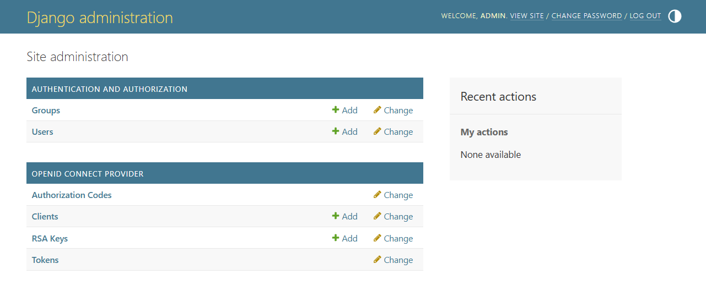
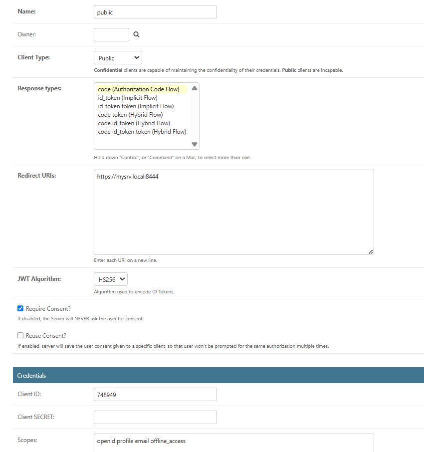
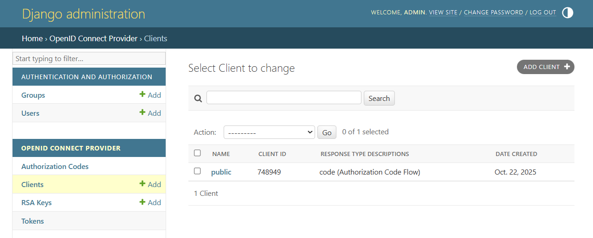

We use `django-oidc_provider` to implement the OIDC IDP. Django is a
full-featured framework for developing web applications. You may need some
familiarity with Django to build more complex apps. Below are simple steps to
work with this demo.

## Setting up the Django DB

Django stores configuration and user data in a `db.sqlite3` file. To apply the
database schema, run:

`python manage.py migrate`

Create a superuser to access the Django admin pages:

`python manage.py createsuperuser`

Launch the Django server (this demo is configured to serve the IDP at the
configured host and port) with:

`python manage.py runserver`

Open the admin page in your browser at:

`https://idp.local:8443/admin`

Log in with the superuser username and password.

## Configure a Public OIDC Client

1. In the admin console, under OPENID CONNECTOR PROVIDER click `Clients` and
  add a new client.
2. Provide a valid name for the client.
3. Select the `client type` as `Public`.
4. In `Response Type` select `code`.
5. Add `https://mysrv.local:8444/` as a Redirect URL (note the trailing slash).
6. Use `HS256` as the JWT algorithm.
7. Check `Require Consent` and uncheck `Reuse Consent`.
8. Save the client. A client ID will be generated; keep it secure for use in
  your PKCE client application.

## Launch the Resource Server

Change into the [pkce](../pkce) folder and launch the resource server with:

`python resource.py`

This will print the authorization code that the client can use.

## Run the client

In the [pkce](../pkce) folder start the client with:

`python client.py`

The client prints a URL that you can open in a browser to begin the flow. The
URL looks like:

`https://idp.local:8443/oidc/authorize?client_id=<<client_id>>&`
`response_type=code&scope=openid+profile+email+offline_access&`
`redirect_uri=https%3A%2F%2Fmysrv.local%3A8444%2F&code_challenge=<<challenge>>&`
`code_challenge_method=S256`

The browser authenticates with the IDP and redirects back to the resource
server with the authorization `code`.

If the IDP session is active you will be shown a consent page. After accepting
consent the authorization code is displayed to the user.

Enter the code at the client command prompt. The client exchanges the code at
the token endpoint to obtain an access token, then calls the userinfo endpoint
to retrieve user information.

The client refreshes the token every minute till it is stopped with ctrl+C. 